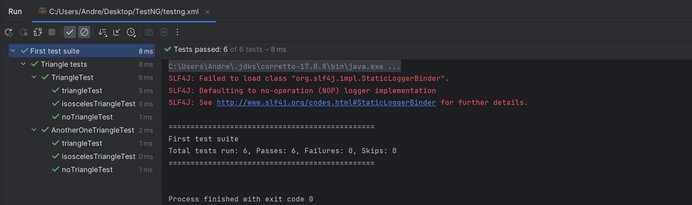
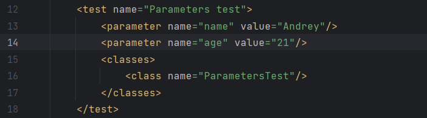
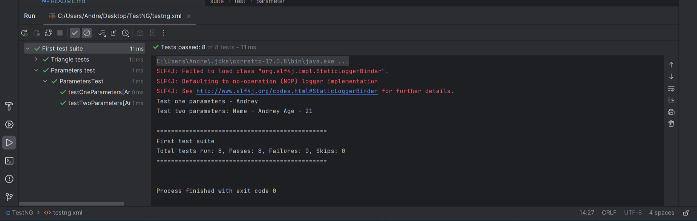

**TestNG** - это тестовый фреймворк, предназначенный как для unit, так и для интеграционных и end-to-end тестов. 
Основная работа строится через использование различных аннотаций. Имеется возможность гибкой конфигурации и многопоточного запуска автотестов.

В TestNG можно использовать data-driven подход, с помощью провайдеров данных @DataProviders, а также 
параметризовать свои тесты. Популярные среды разработки, такие как Eclipse и Idea имеют плагины для работы с TestNG.

Создание простого теста в testng состоит из нескольких шагов. Сначала мы описываем бизнес логику теста. 
Затем добавляем в нее аннотации testng. Следующим шагом нам необходимо добавить конфигурацию нашего теста в файл testng.xml. Теперь у нас всё готово для запуска теста.

---
## Аннотация @Test

Аннотация `@Test` содержит большое количество полей для дополнительных настроек.

- `description` мы можем добавить описание для нашего теста;
- `priority` указывается очередность выполнения тестового метода, Чем меньше значение, тем раньше он будет выполнен. 
Значение по умолчанию 0;
- `enabled` мы можем отключить выполнение тестового метода или класса, указав значение false. По умолчанию enabled имеет значение true.

Более подробное описание с примерами `/src/test/java/TriangleTest` 

### @Test Основные атрибуты 

- `groups` указываются названия групп, в которые наш метод или класс будут входить. 
Это может потребоваться для группировки при запуске тестов или указании зависимостей запусков.
- `dependsOnGroups` и `dependsOnMethods` нужны для создания зависимостей. В dependsOnMethods мы можем указать 
имя другого тестового метода. Если выполнения этого теста завершилось неудачно, текущий тестовый метод не будет 
выполнен.

- `alwaysRun` по умолчанию имеет значение false. Если установить его в true, тестовый метод будет выполнен 
независимо от результата других тестов.

Более подробное описание с примерами `/src/test/java/DependsOnMethodsTriangleTest`

---

## Конфигурация TestNG - testng.xml

С его помощью мы можем настраивать тестовые прогоны, устанавливать зависимости между тестами, устанавливать приоритеты 
запуска тестов. Также можно включать или исключать классы, тестовые методы, пакеты и другие сущности.

### Основные теги
- `<suite>` представляет собой весь xml файл и содержит набор тестов;
- `<test>` содержит один или несколько тестовых классов;


- `<class>` содержит один или несколько тестовых методов.

---

## Параметризация 

Большинство тестов будут отличаться только входными параметрами, для этого в TestNG есть 
параметризованные тесты. В лице аннотации `@Parameters`. 

Для примера напишем небольшой тест, принимающий в качестве параметра:
1. Имя типа String 2. Возраст типа Integer.

Так как, сами значения и имена хранятся в `testng.xml`,



`@Parameters`же содержит **только имена этих значений**.

Отмечу одну особенность, если попытаться запустить тест из тестового класса, то он 
завершиться ошибкой:


Их необходимо запускать напрямую из файла `testng.xml`. Область видимости напрямую зависит, от 
расположения тега `<parameter>`. В нашем примере, данный тег прописан на уровне тега 
`<test>`



Рассмотрим небольшой пример в соответствии файла `testng.xml`
```java
@Parametrs({"Name", "Age"})
@Test
public void testTwoParemetrs(String name, int age){
    // Бизнес логика теста
}
```

Расширим область видимости на два тестовых класса, для этого создадим ещё один класс
`AuxiliaryParametersTest`, а в `testng.xml` переместим тег содержащий значение `Name` в область тега 
`<suite>`
<details>
    <summary>testng.xml</summary>

```
<?xml version="1.0" encoding="UTF-8"?>
<!DOCTYPE suite SYSTEM "http://testng.org/testng-1.0.dtd">
<suite name="First test suite">

    <parameter name="Name" value="Andrey"/>

    <test name="Triangle tests">
        <classes>
            <class name="TriangleTest"/>
            <!--В следствии добавления нового класса, будут запущены все тесты, в данном случае 6-->
            <class name="AnotherOneTriangleTest"/>
        </classes>
    </test>

    <test name="Parameters test">
        <parameter name="Age" value="21"/>
        <classes>
            <class name="ParametersTest"/>
        </classes>
    </test>

    <test name="Auxiliary parameters test">
        <parameter name="Temperature" value="18"/>
        <classes>
            <class name="AuxiliaryParametersTest"/>
        </classes>
    </test>
</suite>
```
</details>

Подробнее и с примерами можно посмотреть по этому пути: `src/test/java/ParametersTest.java`
