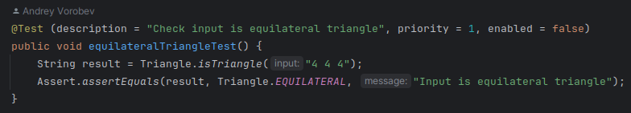
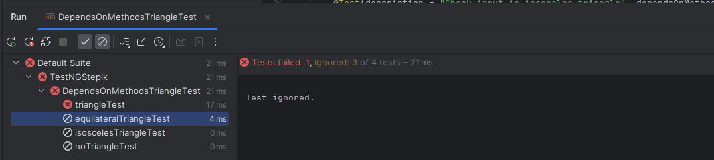

**TestNG** - это тестовый фреймворк, предназначенный как для unit, так и для интеграционных и end-to-end тестов. 
Основная работа строится через использование различных аннотаций. Имеется возможность гибкой конфигурации и многопоточного запуска автотестов.

В TestNG можно использовать data-driven подход, с помощью провайдеров данных @DataProviders, а также 
параметризовать свои тесты. Популярные среды разработки, такие как Eclipse и Idea имеют плагины для работы с TestNG.

Создание простого теста в testng состоит из нескольких шагов. Сначала мы описываем бизнес логику теста. 
Затем добавляем в нее аннотации testng. Следующим шагом нам необходимо добавить конфигурацию нашего теста в файл testng.xml. Теперь у нас всё готово для запуска теста.

---
## Аннотация @Test

Аннотация `@Test` содержит большое количество полей для дополнительных настроек.

- `description` мы можем добавить описание для нашего теста;
- `priority` указывается очередность выполнения тестового метода, Чем меньше значение, тем раньше он будет выполнен. 
Значение по умолчанию 0;
- `enabled` мы можем отключить выполнение тестового метода или класса, указав значение false. По умолчанию enabled имеет значение true.

Более подробное описание с примерами `/src/test/java/TriangleTest` 

### @Test Основные атрибуты 

- `groups` указываются названия групп, в которые наш метод или класс будут входить. 
Это может потребоваться для группировки при запуске тестов или указании зависимостей запусков.
- `dependsOnGroups` и `dependsOnMethods` нужны для создания зависимостей. В dependsOnMethods мы можем указать 
имя другого тестового метода. Если выполнения этого теста завершилось неудачно, текущий тестовый метод не будет 
выполнен.

- `alwaysRun` по умолчанию имеет значение false. Если установить его в true, тестовый метод будет выполнен 
независимо от результата других тестов.

Более подробное описание с примерами `/src/test/java/DependsOnMethodsTriangleTest`

---

## Конфигурация TestNG - testng.xml

С его помощью мы можем настраивать тестовые прогоны, устанавливать зависимости между тестами, устанавливать приоритеты 
запуска тестов. Также можно включать или исключать классы, тестовые методы, пакеты и другие сущности.

### Основные теги
- `<suite>` представляет собой весь xml файл и содержит набор тестов;
- `<test>` содержит один или несколько тестовых классов;
- 
- `<class>` содержит один или несколько тестовых методов.

---

## Параметризация 

